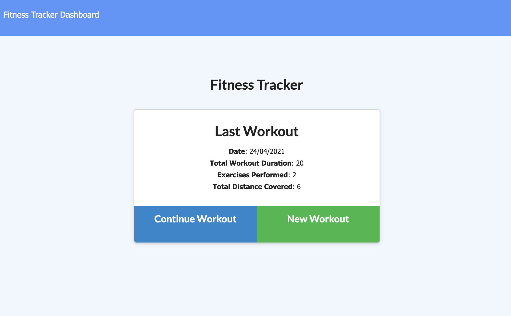

# Workout-Tracker

## Description 
As a user, I want to be able to view create and track daily workouts. I want to be able to log multiple exercises in a workout on a given day. I should also be able to track the name, type, weight, sets, reps, and duration of exercise. If the exercise is a cardio exercise, I should be able to track my distance traveled.

## Technologies Used
* Express * MongoDB * Node.js
* Mongoose * Deploy the app to heroku with Mongo Atlas

## Deployed URL

[Click here for the deployed link!](https://safe-fortress-78688.herokuapp.com/)

## Usage

Here is a demonstration of some of the application:

## License

> This project was created under the [MIT License](https://opensource.org/licenses/MIT)

